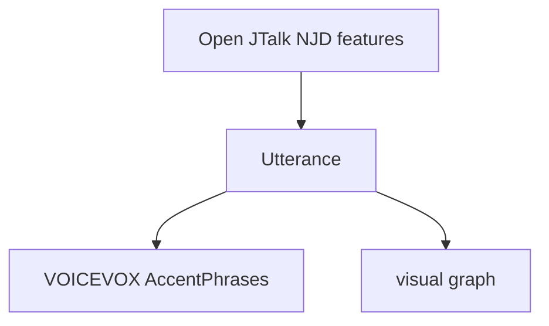

# ParseOJT
Parser of Open JTalk text-processing output (NJD features).



## Dev
### All-in Check
```bash
## check-and-fix
uv run mypy . && uv run ruff check --fix && uv run ruff format && uv run typos && uv run pytest
```

### All-in Static Program Analysis
```bash
# check-only
uv run mypy . && uv run ruff check && uv run ruff format --check && uv run typos

## check-and-fix
uv run mypy . && uv run ruff check --fix && uv run ruff format && uv run typos
```