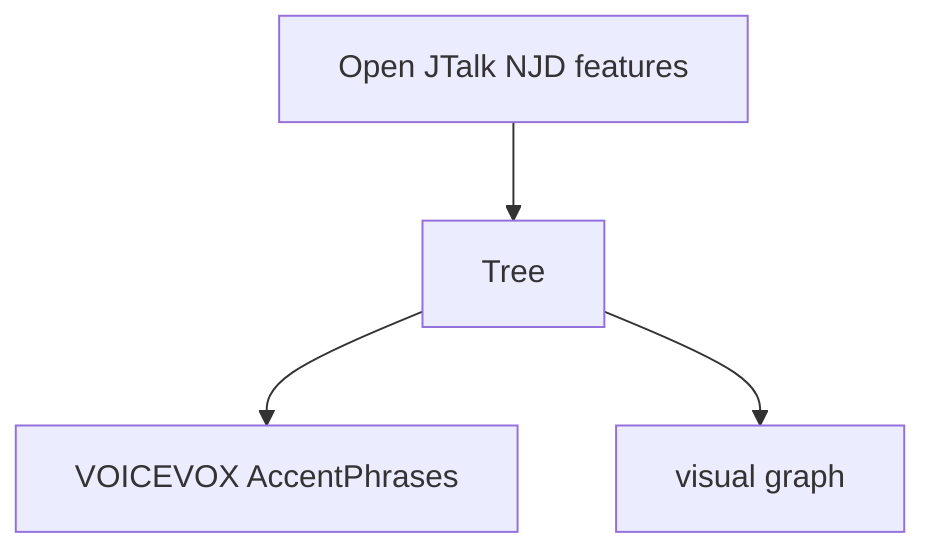

<div align="center">

# 💬 SpeechTree 🌲 <!-- omit in toc -->

Represent speech text with simple-but-rich tree structure, Convert from/to popular TTS formats.  
様々な TTS をつなぐ、シンプルかつリッチな木構造の音声テキスト。

</div>

```python
ojt = openjtalk.run_frontend("相互運用性って良いよね。")
tree = parse_ojt_features(ojt)
vv = parse_as_voicevox(tree)  # Use it for speech synthesis by VOICEVOX API 🎉
graph = parse_as_graph(tree)  # Beautiful graph, see below ✨️
```

[graph]



## Dev
### All-in Check
```bash
## check-and-fix
uv run mypy . && uv run ruff check --fix && uv run ruff format && uv run typos && uv run pytest
```

### All-in Static Program Analysis
```bash
# check-only
uv run mypy . && uv run ruff check && uv run ruff format --check && uv run typos

## check-and-fix
uv run mypy . && uv run ruff check --fix && uv run ruff format && uv run typos
```

### Design Docs
Open JTalk `make_label()` 系（NJD のパーサーとその出力表現）が内部でどんな処理をしているか、web 上に情報がほぼない。  
NJD パーサーとその出力表現を、よりモダンな言語で実装して整理する必要がある。  

フルコンテキストラベルは情報が不足している。表層形の情報を意図的に落としているため、単語と音素の対応が取れない。  
editable な TTS をつくるにはフルコンテキストラベルは役不足であり、新しい規格が必要である。  

Open JTalk `make_label()` 系は NJDNode を JPCommonNode へ変換しており、この時点で表層形の情報を意図的に落としている。  
つまり、`make_label()` 系のモダン再実装をしても情報不足は解決しない。  

そのため、`make_label()` 系の現行挙動を理解したうえで、表層形を保持するスーパーセット的なパーサー・出力表現を新しく提案する必要がある。  

作りたいものは「editable な音声合成における、テキスト処理の最終出力表現」である。  
テキストに話者性はないので、この表現にも話者性は持たせない。そのため音の長さや高さは不要。  
基本的に話者非依存である「発音」「アクセント」「記号イントネーション（！や？）」が合成向けに重要。  
テキスト処理の中間出力でなく最終出力であるため、短単位の自動結合や品詞を用いた自動アクセント推定は完了した前提。そのため品詞や活用は不要。  
また editable にするため、発音やアクセントの修正が必要。そのためには大元となる表層形とその対応付けが必要。じゃないと「何が間違っているか」の「何が」を特定できない。  
前段では「辞書表層形とテキストの一致検索 & 最適系列選択」が基礎となって発音が与えられると想定する（例: MeCab）ため、辞書の「語/ワード」が基準ユニット。  
ワードに表層形と発音がくっつく形。発音はモーラ列へ一意に変換できるので、モーラ列として保持される。  

音声合成が目的であって、テキスト分析が目的ではないことに注意。  
なので表層形は大事だが、基本形は重要ではない。  

TTS が前提であるため、エンドユーザーは文字的に音を指定する。  
より具体的には、発音を（音素や単音でなく）カタカナで指定する。  
これは一般的な日本人の感覚では仮名が音の原子であるため。  
そのため日本人が発音として受け入れられるカタカナ表記は全てカバーするのが好ましい。  
カタカナと音素の対応が 1:1 かはわからない。レアなカタカナ表記（例: ヴャ）が標準的なカタカナ表記（ビャ）と同じ音素という可能性もある。その辺は個人差がデカくて標準化困難かもしれない。  
この点も考えると、モーラと音素が別レイヤーなのも一理がある。  
マッピングを設定値として外に出すのも手。ひとまずは OJT 準拠とする。  
なお、もっと細かくしたいなら単音を音素の下に置けば良い。異音をきっちり分けられる。が、現行で音素→単音を適切に推定する手法は寡聞にして知らない。  

型は str で自由にして、validator でチェックするというのも手。そうすれば validator の rule を設定値で変えられる。  
tree を合成に利用するときはどうせ合成器に合わせて converter を書くので、その時にその合成器に合わせた validator を掛ければ良い。

class TreeManager (かオシャレに Gardener) を用意して、そこに validator や replacer をもたせるのは有り。  
Tree 自体はコンテナ規格なのが大事で、独自のプログラムで Tree を作ってもらうのは一向に構わない。  
dict からのコンバーターを用意しても良い。  

音素一覧やモーラ音素マッピングを SpeechTree 仕様に入れると、これより広い値を取れなくなる。  
今のフルコンテキストラベルが表層形やモーラ種別に不足があるのと同じ構図になる（表層形は種別というより属性ごとないのでちょっと違うけど）。  
そのため standard validator/mapper だけ用意して、仕様としては任意にしておくのがまるそう。Mecab のなんでもつけれるのと似た感じ。  

OJT から取り込む情報とその根拠:
  - string: 読み上げたい書き文字テキストであり、原文の情報として必要。
  - pron: 読み上げるときの音の種類であり、主要な音声情報として必要。なお、string から簡単にはわからない。
  - acc: 読み上げるときの音の高さであり、主要な音声情報として必要。なお、string から簡単にはわからない。
  - chain_flag: アクセント句化の指示であり、アクセント句への構造化に必要。なお、最終的にはフラグ値としては不要。

#### Tree design
##### 基本方針：「不足と重複をなくす」  
既存規格の代表例であるフルコンテキストラベルは、テキストとモーラ発音が不足している。  
これにより意図しない音素が何に由来するか（どのワードか、どのモーラか）がわからない。  
これらを鑑み、SpeechTree では基本方針のひとつに「不足をなくす」を採用する。  

属性の重複は編集を難しくする。なぜなら1箇所の編集が重複箇所の編集を要求するからである。  
クラスであればセッターに同期機能を持たせて緩和できるが、構造体ではそうはいかない。  
SpeechTree は editable TTS 向けであり、編集を前提としている。また複数のライブラリで取り回す前提であり、構造体が好ましい。  
これらを鑑み、SpeechTree では基本方針のひとつに「重複をなくす」を採用した。  

##### 階層の根拠
SpeechTree は日本語標準語が第一言語である。そのため高低アクセントとモーラをサポートする。  

高低アクセントはアクセント句の概念を導き、アクセント句にはちょうど1つのアクセントが割り当てられる。そのためアクセント句が階層のひとつになる。  
アクセント句はテキストによらない、アクセントの位置という概念を扱う。そのためテキストは下位階層で扱われる。  

アクセント句を構成する語（ワード）はテキストに対応しているため、ワードが階層のひとつになる。  
ワードの発音はテキストの規則的な変換では得られない。つまりテキストと発音は重複していない。  

一般的な日本語話者は発音を50音的・カタカナ的に扱う。かつ、音の長さ・拍で音の数を数える。すなわち発音はモーラが単位になっている。  
複数のモーラが集まってワードの発音を構成するため、モーラが階層のひとつになり、それはワードの下になる。  

モーラは1つ以上の音素からなる。  
音素は言語ごとに定義されている。しかし日本語の音素の種類は未だ研究途上にあり、分類にも複数の説がある。  
モーラと音素の対応関係も同様で、同じモーラが異なる音素へマッピングされる場合がある。  
これにより音素はモーラの規則的な変換では得られない。つまりモーラと音素は重複していない。  
よって音素が階層のひとつになり、それはモーラの下になる。  

話者に依存しない音の特徴に、無声化（ ≠ 無声音）がある。  
一般的な日本語話者は意識せずに決まったパターンの無声化をおこなう。そのため発音をカタカナ表記させても無声化は記述されないが、実際の発音では無声化が起きている。  
そのため無声化は発音より下、すなわちモーラより下が適切である。  
無声化は音素の単位でおきているため、音素の階層に配置されるべき情報である。そのため無声化は階層はつくらず、音素の属性とするのが良い。  

アクセント句より上の階層に着目すると、一息の区切りがある。  
アクセント句は複数をひと続きとして一息で発声されうる。つまりアクセント句はグループをつくる。そのためブレスグループが階層のひとつになる。    
ブレスグループの定義により、ブレスグループとブレスグループ（= 一息と一息の間）には発声を伴わない区間がある。  
この区間は一種類の単なる無音ではなく、複数種類が存在しかつ複数個が連続して存在でき、ブレスグループの発声方法へも影響を与える。  
テキストで表現すれば「、」「。」「？」「！」「『」「　」「」など様々であり、約物と総称される。  
ひと続きの役物をマークグループとみなせば、文はブレスグループとマークグループが交代で並ぶものとみなせる。  
役物は無音であるためアクセントを持たず単一のアクセント句に属し、各役物はそれぞれ独立しているので別々のワードとみなせる。  
無音であるためどれもモーラ発音は「　」音素は「pau」とすれば、アクセント句はブレスグループ下のものと全く同じ構造になる。  
よってマークグループは階層のひとつとなり、ブレスグループと同じスーパークラスを継承する兄弟になる。  

グループの列が文であり、最終レベルである。  
頂点のノードに付与する情報がないため、頂点ノードを暗示的なものとしてグループ列の型エイリアスを Tree と呼ぶ。  


#### History
- 着想 ver1：「フルコンテキストラベルがまどろっこしい」
- 着想 ver2：「`make_label()` の処理内容がぱっと見でわからなすぎる」
- 着想 ver3：「フルコンテキストラベルは情報が不足してる気がする」
- 着想 ver4：「JPCommon への変換時に情報落としすぎている」
- 着想 ver5：「もう少しリッチな中間表現が TTS には必要なのでは？」

#### Notes
木構造 tree  
音声的  
個別モーラのピッチは持たず、アクセント句のみ。  
→ voice 一般（∋ 歌声）ではなく、speech 寄り。  

# speech_tree = sorted(list(set(MR_CV.keys())))
# voicevox = sorted(list(set(map(lambda s: s[0], vv_mapping))))
# ojt_vv_diff_phonemes = ['ウゥ', 'キィ', 'ギィ', 'クァ', 'クィ', 'クゥ', 'クェ', 'クォ', 'グァ', 'グィ', 'グゥ', 'グェ', 'グォ', 'ヂェ', 'ヂャ', 'ヂュ', 'ヂョ', 'テェ', 'デェ', 'ニィ', 'ヒィ', 'ビィ', 'ピィ', 'ミィ', 'リィ', ]
# diff_s = list(filter(lambda s: s[0] in ojt_vv_diff_phonemes, vv_mapping))
# ojt_vv_diff_sets = [('リィ', 'ry', 'i'), ('ミィ', 'my', 'i'), ('ピィ', 'py', 'i'), ('ビィ', 'by', 'i'), ('ヒィ', 'hy', 'i'), ('ニィ', 'ny', 'i'), ('デェ', 'dy', 'e'), ('テェ', 'ty', 'e'), ('グォ', 'gw', 'o'), ('グェ', 'gw', 'e'), ('グゥ', 'gw', 'u'), ('グィ', 'gw', 'i'), ('クォ', 'kw', 'o'), ('クェ', 'kw', 'e'), ('クゥ', 'kw', 'u'), ('クィ', 'kw', 'i'), ('ギィ', 'gy', 'i'), ('キィ', 'ky', 'i'), ('ウゥ', 'w', 'u'), ('ヂョ', 'j', 'o'), ('ヂュ', 'j', 'u'), ('ヂャ', 'j', 'a'), ('ヂェ', 'j', 'e'), ('グァ', 'gw', 'a'), ('クァ', 'kw', 'a')]


Tree  Gardener

Tree は木構造を定義するだけ。  
Gardener が validation や placement を提供。  
単なる関数ではなく class にすることで、param を受け入れて機能を変えられる。  
char set とかを変えることで上手く validation できる。  

parser が各入力向けの Tree 製造機。  
converter が各出力向けの Tree 消費機。  

Gardener.trim_head_tail_marks(tree: Tree) -> Tree:
  if tree.groups[0] is instanceof(MarkGroup):
    tree.groups = tree.groups[1:]
  if tree.groups[1] is instanceof(MarkGroup):
    tree.groups = tree.groups[:-1]

